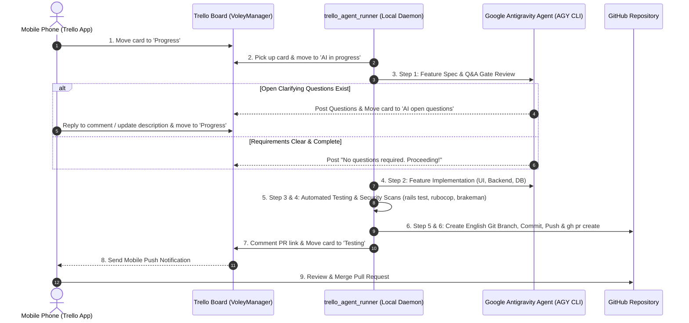

# Trello Remote AI Agent Automation Framework

An autonomous, mobile-first workflow integration that connects **Trello** (mobile board management) with **Google Antigravity / AGY AI Agents** and **GitHub Pull Requests**.

This framework allows software engineers and product owners to request features, bug fixes, or enhancements from their mobile devices using Trello, and have an autonomous AI agent code the feature, run pre-flight tests/security scans, open a clean GitHub Pull Request, and notify Trello in real time.

---

## 🌟 What Is This?

This is a **Remote Mobile AI Developer Agent Pipeline & Skill**. It turns a Trello board into a mobile command center for autonomous software development.

```
┌───────────────────────────┐      ┌───────────────────────────┐      ┌───────────────────────────┐
│  Mobile Phone (Trello)    │ ──── │   Local AGY AI Watcher    │ ──── │   GitHub Pull Request     │
│  - Move card to Progress  │      │   - 6-Step Pipeline       │      │   - Clean branch off main │
│  - Answer Q&A comments    │      │   - Interactive Q&A Gate  │      │   - All tests passing     │
└───────────────────────────┘      └───────────────────────────┘      └───────────────────────────┘
```

---

## 🔄 How The 6-Step Pipeline Works



---

## 📋 Trello Board Column Configuration

To use this framework, configure your Trello board with the following columns:

| Column Name | Purpose |
|---|---|
| **`ToDo` / `Backlog`** | Ideas, tasks, and future feature requests. |
| **`Progress`** | **Trigger Column**. Move any card here from mobile to start the AI agent. |
| **`AI in progress`** | **Working Column**. Agent automatically moves active card here while coding. |
| **`AI open questions`** | **Q&A Pause Column**. Agent moves card here if clarifying design questions are needed. |
| **`Testing`** | **Review Column**. Agent moves card here when PR is created and all tests pass green. |
| **`Done` / `In Prod`** | User moves card here after reviewing and merging the PR. |

---

## 🔔 Mobile Push Notifications Guide

By default, Trello suppresses push notifications for actions performed by your own user account token (since Trello assumes you made those comments/moves yourself).

To ensure instant mobile push notifications on iOS/Android:

1. **Option A (Dedicated Bot Account - Recommended)**: Create a secondary free Trello account (e.g. `VolleyManager Bot`), invite it to your board, and generate `TRELLO_TOKEN` from that bot account.
2. **Option B (Telegram / Push Webhook)**: Connect a Telegram bot or push notification webhook inside `bin/trello_agent_runner`.
3. **Option C (Trello Board Watch)**: Open your mobile Trello app, navigate to the board or specific columns (`AI open questions` & `Testing`), and tap **"Watch"** (Seguir).

---

## 🔑 Setup & Credentials Guide

### Step 1: Get Trello API Credentials
1. Go to [trello.com/app-key](https://trello.com/app-key) in your web browser.
2. Copy your **API Key** (`TRELLO_API_KEY`).
3. Click **"generate a Token manually"** (enlace `token`), grant Read/Write authorization, and copy your **Token** (`TRELLO_TOKEN`).

### Step 2: Get Your Board ID
Run the built-in checker tool:
```bash
TRELLO_API_KEY=your_key TRELLO_TOKEN=your_token bin/trello_agent_runner --check
```
Locate your target board in the output list and copy its 24-character hex ID (e.g. `6947e52c576bbdd20b28848a`).

### Step 3: Configure Environment Variables
Create a `.env` file in your project root:
```env
TRELLO_API_KEY=your_trello_api_key
TRELLO_TOKEN=your_trello_token
TRELLO_BOARD_ID=your_trello_board_id
TRELLO_SOURCE_LIST=Progress
TRELLO_WORKING_LIST=AI in progress
TRELLO_QUESTIONS_LIST=AI open questions
TRELLO_TARGET_LIST=Testing
```

---

## 🚀 Quickstart & Makefile Commands

```bash
# Install dependencies
bundle install

# Verify Trello connection and view cards in queue
make trello-check

# Start the continuous AI Watcher (polls Trello every 30s)
make trello

# Run test suite
make test
```

---

## 🛠️ Key Features

- **Mobile First**: Initiate features, answer questions, and review PR notifications directly from your smartphone via Trello.
- **Smart Q&A Review Gate**: Evaluates requirements against codebase architecture before coding. If ambiguous, posts questions and pauses cleanly until you reply.
- **Iterative Feedback Loop**: Add comments or update instructions on Trello at any time; the agent picks up your replies, checks out the existing feature branch, and updates the PR seamlessly.
- **Clean Git Hygiene**: Automatically creates fresh, isolated feature branches off `main` in English, eliminating branch pollution.
- **Security & Quality Gated**: Only opens PRs after 100% of unit tests (`rails test`), style checks (`rubocop`), and security audits (`brakeman`) pass green.

---

## 📄 License

[MIT License](LICENSE) © 2026 Franco Rodriguez
